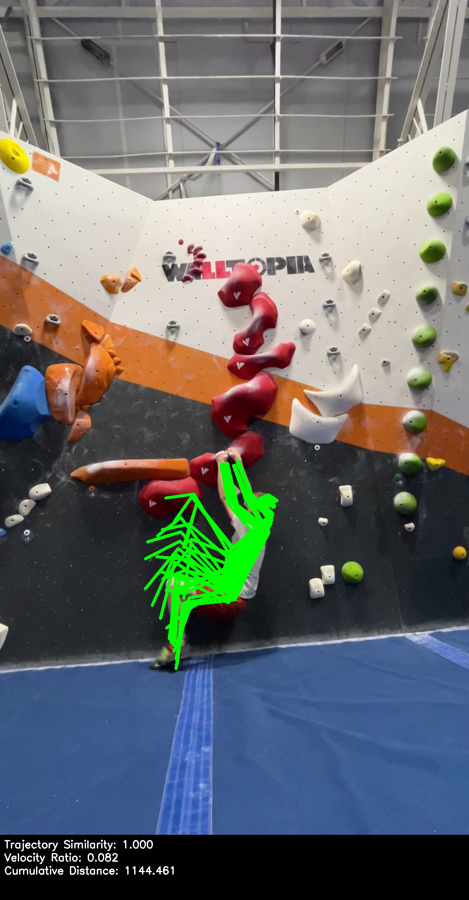

# BoulderVision: Climbing Movement Analysis 🧗‍♀️

BoulderVision is a computer vision tool that analyzes climbing movements in videos. It tracks a climber's movements, detects holds, and provides real-time visualization of movement patterns and velocity metrics.


[](https://www.youtube.com/watch?v=ClsECogdT7A)


Ever wondered how your climbing moves stack up? BoulderVision is like having a personal climbing coach with a knack for data! Using the power of computer vision (thanks to OpenCV and Roboflow!), we analyze your climbing sessions, tracking every move, hold, and shift in velocity.

Imagine having a tool that not only watches your climbs but also breaks down your movements into insightful metrics. Want to know if you're following the optimal path? Curious about your speed and efficiency on the wall? BoulderVision provides real-time visualizations and detailed analysis to help you climb smarter.

Whether you're a coach refining techniques, a climber perfecting your project, or just someone who loves data-driven insights, BoulderVision turns your climbing footage into actionable feedback. No more guesswork—just clear, data-backed insights to help you send your projects with confidence!

Ready to elevate your climbing game? Let's dive into the data and start analyzing those moves!


## Getting Started

1. Clone the repository
```bash
git clone https://github.com/danielreiff/boulder-vision.git
```
2. Create a Python environment and install dependencies
```bash
python3.11 -m venv boulder-vision
source boulder-vision/bin/activate
pip install -r requirements.txt
pip install --upgrade supervision
```
3. Set up your Roboflow credentials
```bash
export ROBOFLOW_API_KEY="your_api_key"
```
4. Ensure your configurations are set in the config.yaml file.
5. Run the script with your desired configuration
```bash
python main.py
```
6. Let the program run, observe status updates, and enjoy the output! The updates will be displayed in the terminal.
```
Video setup:
- Duration: 64.4s (1.1min)
- Processing from: 19.0s (0.3min)
- Processing to: 45.0s (0.8min)
- Frame stride: 1 (effective FPS: 29.0)
- Frames to process: 754
102it [11:33,  7.71s/it]
```
Once the script has finished processing, you will see the following output:
```
Processing complete. Analyzing climb metrics...

Climbing Movement Analysis:

Climb Duration: 86 frames
Climb Duration: 2.9655172413793105 seconds

1. Movement Dynamics (velocity ratio):
• Slowest movement: 0.07x average speed
• Fastest movement: 8.76x average speed
• Average movement speed: 1.09x
  (Values > 1 indicate faster than average movements, < 1 indicate slower movements)

2. Distance Coverage (in pixels):
• Total distance covered: 48327.17
• Average distance per frame: 627.63
  (Higher values indicate more dynamic movement, lower values suggest static positions)
```


## Features
- **Pose Detection**: Tracks 17 key body points throughout the climbing sequence
- **Hold Detection**: Identifies climbing holds, their locations, and colors in the frame
- **Movement Analysis**: 
  - Tracks cumulative movement over time
  - Calculates velocity ratios for movement analysis
  - Visualizes movement patterns with temporal color coding
- **Real-time Visualization**:
  - Multi-view display showing tracking, keypoints, and heatmaps
  - Live plotting of movement metrics
  - Interactive display of hold-body point matching


## Movement Analysis Metrics

The system calculates three key metrics to analyze movement patterns:




#### 1. Trajectory Similarity (trajectory_cos_sim)
- Measures how closely the current movement follows the expected path using cosine similarity
- Range: [-1 to 1]
  - 1: Movements are identical in direction
  - 0: Movements are perpendicular
  - -1: Movements are in opposite directions
- Useful for detecting if a climber is following a similar path to previous attempts

#### 2. Velocity Ratio (velocity_ratio)
- Compares the current movement speed to the average speed over the previous window
- Interpretation:
  - > 1: Moving faster than the average historical speed
  - = 1: Moving at the same speed as the average
  - < 1: Moving slower than the average historical speed
- Helps identify acceleration/deceleration patterns and potential resting points

#### 3. Cumulative Distance (cumulative_distance)
- Total distance traveled by all keypoints over the analysis window
- Measured in pixels (or the units of your coordinate system)
- Higher values indicate more overall movement
- Useful for:
  - Detecting static vs. dynamic sequences
  - Identifying rest periods (low values)
  - Quantifying the amount of movement in a sequence

## Output
The script generates:
1. A processed video showing:
   - Climber tracking
   - Hold detection
   - Movement heatmaps
   - Real-time movement metrics
2. CSV file with movement data
3. Visualization overlays including:
   - Body keypoint tracking
   - Hold detection boxes
   - Movement metrics plots

## Configuration
All parameters can be configured in `config.yaml`:

```yaml
video:
  start_seconds: 0        # Start time for video processing
  end_seconds: null       # End time (null for full video)
  stride: 2              # Process every nth frame

visualization:
  plot:
    width: 1920          # Output plot width
    height: 1080         # Output plot height
    style: "dark"        # Plot style theme
  overlay:
    show_keypoints: true # Display body keypoints
    show_holds: true     # Display detected holds
    show_metrics: true   # Display movement metrics
```

Modify these parameters in the config file before running the script to customize the analysis behavior and visualization output.

## Contributing
Feel free to submit issues and enhancement requests!
