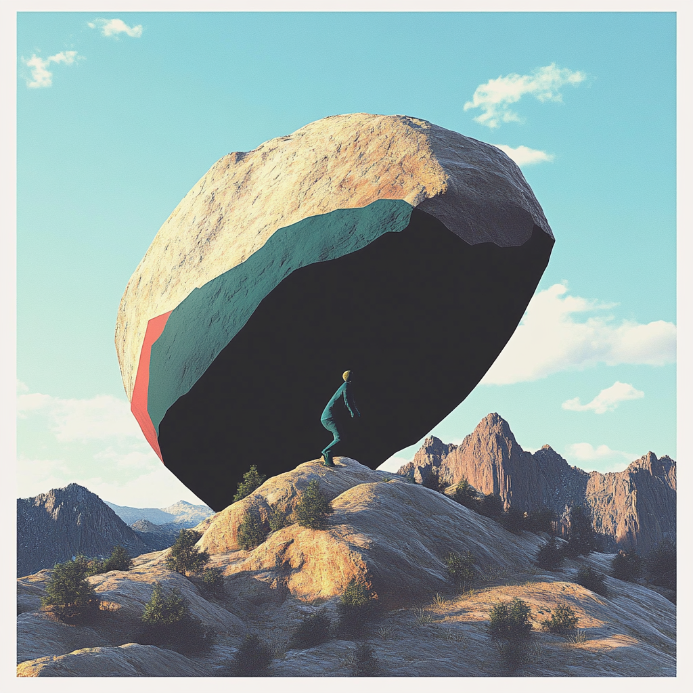

# BoulderVision: Climbing Movement Analysis

## Overview
BoulderVision is a computer vision tool that analyzes climbing movements in videos. It tracks a climber's movements, detects holds, and provides real-time visualization of movement patterns and velocity metrics.

<p align="center">
  
</p>


<iframe width="560" height="315" src="https://www.youtube.com/embed/ClsECogdT7A?si=huVahFDiowMkyi1g" title="YouTube video player" frameborder="0" allow="accelerometer; autoplay; clipboard-write; encrypted-media; gyroscope; picture-in-picture; web-share" referrerpolicy="strict-origin-when-cross-origin" allowfullscreen></iframe>

## Features
- **Pose Detection**: Tracks 17 key body points throughout the climbing sequence
- **Hold Detection**: Identifies climbing holds in the frame
- **Movement Analysis**: 
  - Tracks cumulative movement over time
  - Calculates velocity ratios for movement analysis
  - Visualizes movement patterns with temporal color coding
- **Real-time Visualization**:
  - Multi-view display showing tracking, keypoints, and heatmaps
  - Live plotting of movement metrics
  - Interactive display of hold-body point matching

## Requirements

Core dependencies:
- OpenCV
- NumPy
- Plotly
- Supervision
- Roboflow Inference SDK
- PIL
- matplotlib
- tqdm

## Setup
1. Clone the repository
2. Install dependencies
3. Set up your Roboflow credentials:
   ```python
   API_URL = "https://boulder-vision.roboflow.cloud"
   API_KEY = "your_api_key"
   ```

## Usage
```python
from detect_holds_workflow import ClimbingAnalyzer

### Initialize analyzer
analyzer = ClimbingAnalyzer(
api_url="your_api_url",
api_key="your_api_key",
workspace_name="your_workspace",
workflow_id="your_workflow_id"
)

### Process a video
video_path = "path/to/your/video.mp4"
analyzer.process_video(video_path)

```


## Output
The script generates:
1. A processed video showing:
   - Climber tracking
   - Hold detection
   - Movement heatmaps
   - Real-time movement metrics
2. CSV file with movement data
3. Visualization overlays including:
   - Body keypoint tracking
   - Hold detection boxes
   - Movement metrics plots

## Configuration
Key parameters can be adjusted in the script:
- `start_seconds`: Start time for video processing
- `end_seconds`: End time for video processing
- `stride`: Frame processing stride
- Plot dimensions and styling
- Visualization overlay settings

## Contributing
Feel free to submit issues and enhancement requests!
